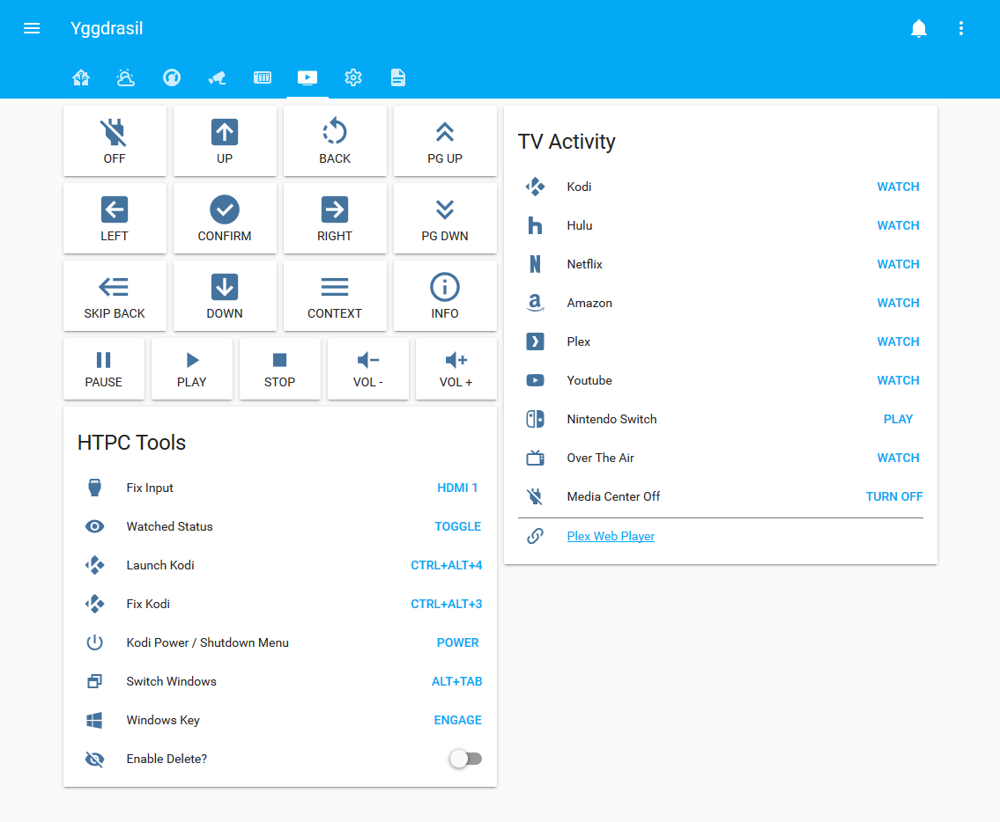

# Home Assistant Config by Bishma



I have been working to automate my home as much as my 50 year old wiring allows. I aim to accomplish all my automations with a RaspPi, no other hubs apart from the usb z-wave stick. This has been a slowly evolving config.

# Features

* I've gone to default Lovelace.
  * My legacy config is still in place but far less capable.
* Conditional UI based on settings (binary inputs)
  * E.g. The buttons to control my stand fan (via Harmony IR) only show if I indicate that my stand fan is out. It gets put away for the winter.
* Fully managed for all my sensors and devices. No auto discovery.
* Universal remote for my media center.
* Dynamic alexa intents. So far just for my media center.
  * "Alexa ask home assistant to turn the tv up by 5."
* Presence detection using Tile trackers.
  * Sensor template to indicate when the house is empty.
* On/Off control for Z-Waze through Home Assistant Cloud / Nebu Casa
  * Mainly to support the Home Assisant team.
* Documentation tab in the app through markdown cards
* Custom Attribute Card from [ciotlosm/custom-lovelace](https://github.com/ciotlosm/custom-lovelace)
* Cutom Slider Entity Card from [thomasloven/lovelace-slider-entity-row](https://github.com/thomasloven/lovelace-slider-entity-row)
* IFrame-able weather map from [windy.com](https://www.windy.com/)
* US National Weather System Alerts pushed through Telegram
  * Using NWS API and a rest sensor as demonstrated by [Finity on the HASS Forums](https://community.home-assistant.io/t/severe-weather-alerts-from-the-us-national-weather-service/71853)

## Screen Shots

* [Home Tab](screenshots/view_home.png)
* [Climate Tab](screenshots/view_climate.png)
* [Indoor Climate Tab](screenshots/view_ndoor-climate.png)
* [Camera Tab](screenshots/view_camera.png)
* [Network Tab](screenshots/view_network.png)
* [Media Center Tab](screenshots/mobile_media.png)

# My Setup

## Hardware

* Raspberry Pi 3
* Aeotech Z-Wave Stick
* GE Outdoor Z-Wave Switch
* EcoBee 2 Thermostat
* Harmony Home Hub
* Broadlink Mini 3 IP Blaster
* Intel NUC D54250WYK1 Intel 4th Gen Core i5-4250U running Windows 10 (HTPC / Plex Server)
* Roku Stick
* Synology
* Amazon Echo
* Amazon Echo Dot
* 2x TP Link LB120 Tunable A19
* TP Link LB230 Multi-Color BR30
* 2x TP Link HS100 Wifi Switch
* TP Link HS105 Mini Wifi Switch
* 3x Tile Trackers
* Ring Video Doorbell 2
* 2x Amcrest Pan/Tilt/Zoom security cameras (via synology surveillance stations)
* Netatmo Indoor and Outdoor climate sensors

## Software / API

* Home Assistant
* Home Assisant Cloud
* Hass.io
* Custom Alexa Skill
* Dark Sky (sensor) and Yahoo Weather
* Speedtest.net
* Waze Travel Time
* Lyft and Uber
* Windy.com

# This Repo

* This is a living document. What you see here is what is running my house.

## Structure
* All configs branch off configuration.yaml
* Files are broken up by functionality. Switches, sensors, scripts, etc.
  * The yaml that controls the individual lovelace tabes are stored in ```lovelace_cards/```
* Generated files (.conf, .log, .json, etc) are generally not committed.
* All sensitive information is stored on secrets.yaml which is also not committed.

## Home Assistant "TNG?"

The Next Generation: In 2017 in app config editors started to become available. When it was clear that I'd have to rework how I have split up my cofigs to make them work I decided to just start over from scratch.

The old config is [here](https://github.com/Bishma/homeassistant). Yes, if I ever start over again the new repo will be ds9.