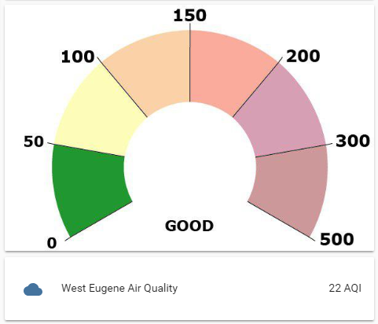
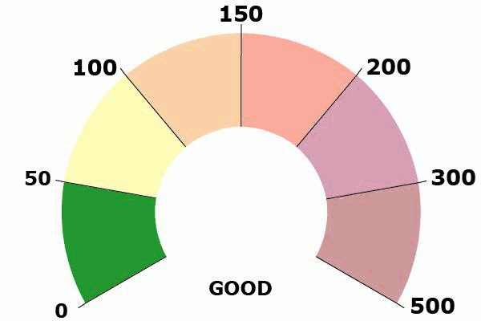

# WAQI Meter

The west coast of the United States has had some trouble breathing the last few months due to the many fires in the region. Several cities, including my own, have had the worst air quality in the world at various points of the summer and autumn. I had been checking the regional air quality daily for some time when I discovered that there is a [World Air Quality Index sensor](https://www.home-assistant.io/components/sensor.waqi/) component in [Home Assistant](https://www.home-assistant.io).

I added the sensor and plopped the numeric value into an entity card and didn't think much more about it. Whenever I needed it I would check the value and, since the air was so routinely terrible, I had a good sense of what the integer value I was seeing meant. Only when the [gauge card](https://www.home-assistant.io/lovelace/gauge/) was introduced did I realize that seeing a number on screen doesn't give any context. When conditions improved locally, the time between my check-ins grew longer, and my memory of the scale grew fuzzy. I'd then have to go to an external site to look up the meaning of the number in hass. I wasn't all that better off after all.

The gauge card was a nice step forward but it's limits for this use case were quickly evident. The three color conditions offered by the gauge card didn't match up well with the six categories of the AQI and it still didn't really offer context. Green is good, certainly, but how bad is yellow? Still, it was better so life went on.

Then it dawned on me that a template sensor can be used to translate ranges of numeric values into categories, which then makes the [picture entity card](https://www.home-assistant.io/lovelace/picture-entity/) a display option.



## Prerequisites

Set up the WAQI sensor following the instructions in the [component docs](https://www.home-assistant.io/components/sensor.waqi/).

## Template Sensor

This is a very simple sensor. All that we need is a set of conditions such that 0 - 50 is good, 51 - 100 is moderate, etc. I took one small precaution against the WAQI sensor not having data for any reason with my else condition.

```YAML
- platform: template
  sensors:
    waqi_state:
      entity_id: sensor.waqi_eugene__highway_99_oregon_usa
      friendly_name: West Eugene Air Quality
      value_template: >
        
          good
        
          moderate
        
          unhealthy-1
        
          unhealthy-2
        
          unhealthy-3
        
          hazardous
        
          unknown
        
```

## Picture Entity Card

Keeping it simple here as well. There is one image for each of the states from my sensor defined in my picture entity card's state_image variable. I didn't want to pad the bottom of my images in order to cleanly display the name or state on the picture card, so I've put it in a vertical stack with a entity card that displays the AQI value. I believe I could combine the two by way of a picture-elements card, but that is a project for another day.

```YAML
- id: west_eugene_air_quality stack
  type: vertical-stack
  cards:
    - type: picture-entity
      entity: sensor.waqi_state
      show_name: false
      show_state: false
      state_image:
        "good": /local/air-quality/good.jpg
        "moderate": /local/air-quality/moderate.jpg
        "unhealthy-1": /local/air-quality/unhealthy-1.jpg
        "unhealthy-2": /local/air-quality/unhealthy-2.jpg
        "unhealthy-3": /local/air-quality/unhealthy-3.jpg
        "hazardous": /local/air-quality/hazardous.jpg
        "unknown": /local/air-quality/unknown.jpg
    - type: entities
      entities:
        - entity: sensor.waqi_eugene__highway_99_oregon_usa
          name: West Eugene Air Quality
```

## Images

This was the most time consuming part of the project. I started by trying to turn a png of a serviceable chart found online into what I wanted. In the process I had the kind of things to say to Gimp that can only be dreamt up by a true novice in the software. It was at that point my [graphic designer](http://bdrose.net/) wife, Bonnie, took pity on me as this kind of image work is in her wheelhouse.



This ticks all my boxes. I now get an on-demand view of our local air quality in an attractive card. It gives context to the values both in specific meaning and in scale. That makes it good at delivering quick meaning at a glance and details upon closer inspection.